# 校企对接平台全面技术分析报告

## 1. 技术栈分析

### 1.1 核心技术栈

#### 后端技术栈
- **编程语言**: Python 3.11
- **Web框架**: Django 5.1.7 + Django REST Framework 3.15.2
- **异步通信**: Django Channels (WebSocket支持)
- **API架构**: RESTful API + WebSocket实时通信

#### 前端技术栈
- **架构模式**: 前后端分离架构
- **支持协议**: HTTP/HTTPS + WebSocket
- **跨域处理**: django-cors-headers 4.7.0

#### 数据库技术栈
- **关系型数据库**: MySQL 8.0 (主数据存储)
- **缓存数据库**: Redis 5.2.1 (缓存、会话、消息队列)
- **向量数据库**: Milvus 2.4.8 (AI搜索、向量存储)

#### 认证与安全
- **认证方式**: JWT (JSON Web Token)
- **密码哈希**: Argon2-CFFI 23.1.0
- **跨域安全**: CORS配置
- **中间件安全**: Django安全中间件栈

### 1.2 第三方库依赖详细分析

#### 核心框架依赖
```
Django==5.1.7                    # Web框架核心
djangorestframework==3.15.2      # REST API框架
djangorestframework-simplejwt==5.5.0  # JWT认证
django-cors-headers==4.7.0       # 跨域处理
channels==4.0.0                  # WebSocket支持
channels-redis==4.1.0            # Channels Redis后端
```

#### 数据库与缓存
```
mysqlclient==2.2.7              # MySQL数据库连接器
django-redis==5.4.0             # Redis Django集成
redis==5.2.1                    # Redis Python客户端
pymilvus==2.4.8                 # Milvus向量数据库客户端
```

#### 异步任务处理
```
celery==5.5.1                   # 分布式任务队列
django-celery-beat==2.5.0       # Celery定时任务调度
kombu==5.3.4                    # Celery消息传输
billiard==4.2.0                 # Celery进程池
```

#### 文件处理与AI
```
Pillow==11.1.0                  # 图像处理(头像上传)
PyMuPDF==1.24.14               # PDF文档处理
openpyxl==3.1.5                # Excel文件处理
numpy==2.2.5                   # 数值计算
pandas==2.2.3                  # 数据分析
```

#### 开发与部署工具
```
gunicorn==23.0.0                # WSGI HTTP服务器
whitenoise==6.6.0               # 静态文件服务
python-dotenv==1.0.1            # 环境变量管理
pytz==2025.1                    # 时区处理
```

#### 测试与质量保证
```
pytest==8.3.5                   # 测试框架
pytest-cov==6.1.1              # 测试覆盖率
bandit==1.8.3                  # 安全检查
colorama==0.4.6                # 日志着色
```

## 2. 系统架构设计

## 3. 系统组件详细分析

### 3.1 核心业务模块

#### 用户认证模块 (Authentication)
- **功能**: 用户注册、登录、密码管理、JWT令牌管理
- **核心组件**: 
  - 邮箱验证码系统 (Redis存储)
  - JWT认证中间件
  - 账户删除管理
  - 登录日志记录
- **数据存储**: MySQL (用户数据) + Redis (验证码、会话)

#### 用户管理模块 (User Management)
- **功能**: 用户资料管理、标签系统、头像上传
- **核心组件**:
  - 学生用户管理
  - 组织用户管理
  - 兴趣标签 (Tag1) 和能力标签 (Tag2)
- **数据存储**: MySQL (用户资料、标签关联)

#### 组织管理模块 (Organization)
- **功能**: 企业组织管理、成员权限控制、组织审核
- **核心组件**:
  - 组织信息管理
  - 成员权限系统 (owner/admin/member)
  - 组织审核流程
  - 操作日志记录
- **数据存储**: MySQL (组织数据、权限关系)

#### 项目管理模块 (Project)
- **功能**: 需求发布、资源管理、文件系统
- **核心组件**:
  - 需求管理系统
  - 虚拟文件系统
  - 资源下载统计
  - 收藏功能
- **数据存储**: MySQL (项目数据) + 文件存储系统

#### 学生项目模块 (Student Project)
- **功能**: 项目申请、团队协作、成果提交
- **核心组件**:
  - 项目申请与审核
  - 团队成员管理
  - 项目邀请系统
  - 成果交付管理
  - 评论系统
- **数据存储**: MySQL (项目关系、成果数据)

#### 项目评分模块 (Project Score)
- **功能**: 评分标准管理、项目评分、排名系统
- **核心组件**:
  - 评分标准模板
  - 多维度评分指标
  - 项目排名算法
  - 评分结果公示
- **数据存储**: MySQL (评分数据、排名结果)

#### 通知系统模块 (Notification)
- **功能**: 实时通知、邮件通知、通知模板管理
- **核心组件**:
  - WebSocket实时推送
  - 邮件通知策略
  - 通知模板引擎
  - 通知偏好设置
- **数据存储**: MySQL (通知数据) + Redis (在线用户、消息队列)

#### 智能搜索模块 (AI Search)
- **功能**: 向量搜索、智能匹配、PDF文档处理
- **核心组件**:
  - 文本向量化
  - 相似度搜索
  - PDF内容提取
  - 搜索结果排序
- **数据存储**: Milvus (向量数据) + Redis (搜索缓存)

### 3.2 基础设施组件

#### 缓存系统 (Redis)
- **用途**: 
  - 会话存储
  - 验证码缓存
  - API响应缓存
  - WebSocket连接管理
  - Celery消息队列
- **配置**: 多数据库分离 (缓存/会话/队列/WebSocket)

#### 异步任务系统 (Celery)
- **功能**: 
  - 邮件发送任务
  - 数据清理任务
  - 统计数据更新
  - 定时任务调度
- **组件**: Celery Worker + Celery Beat + Redis Broker

#### 文件存储系统
- **功能**: 
  - 用户头像存储
  - 项目文件管理
  - PDF文档处理
  - 云盘链接管理
- **架构**: 本地存储 + 云存储支持

## 4. 组件间交互关系与数据流向

### 4.1 用户认证流程

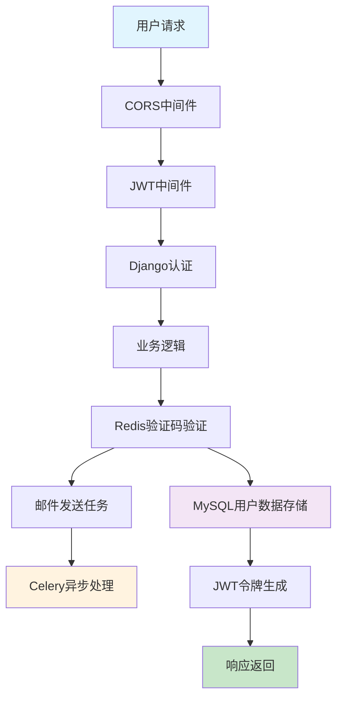

### 4.2 实时通知流程

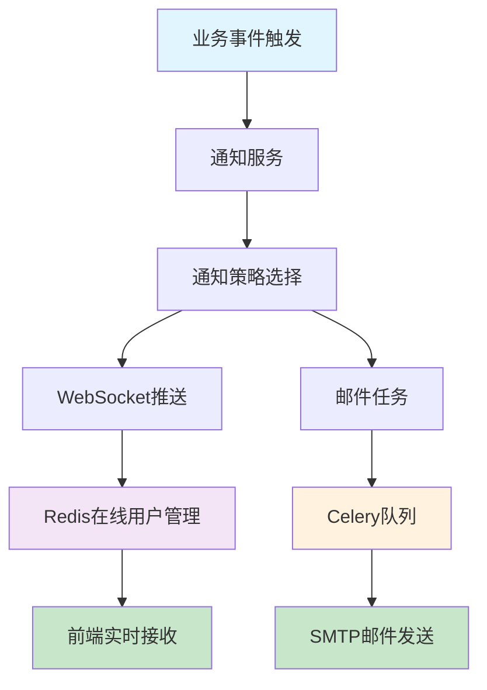

### 4.3 智能搜索流程

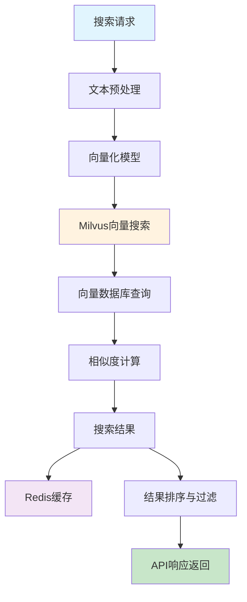

### 4.4 项目协作流程

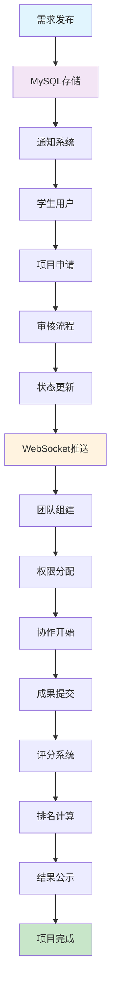

### 4.5 数据一致性保证
- **事务管理**: Django数据库事务确保数据一致性
- **缓存同步**: Redis缓存与MySQL数据同步策略
- **异步任务**: Celery确保异步操作的可靠性
- **消息队列**: Redis作为消息中间件保证消息传递

### 4.6 性能优化策略
- **数据库优化**: 索引优化、查询优化、连接池管理
- **缓存策略**: 多层缓存架构、缓存预热、缓存更新策略
- **异步处理**: 耗时操作异步化、任务队列负载均衡
- **静态资源**: CDN加速、文件压缩、浏览器缓存

## 5. 系统特色与创新点

### 5.1 技术创新
- **AI驱动搜索**: 基于Milvus向量数据库的智能项目匹配
- **实时通信**: WebSocket + Redis实现的高性能实时通知系统
- **微服务架构**: 模块化设计支持独立部署和扩展
- **多策略通知**: WebSocket + 邮件的多渠道通知机制

### 5.2 架构优势
- **高可扩展性**: 基于Django的模块化架构支持水平扩展
- **高可用性**: Redis集群 + MySQL主从 + Celery分布式任务
- **高性能**: 多层缓存 + 异步处理 + 数据库优化
- **高安全性**: JWT认证 + CORS安全 + 数据加密存储

### 5.3 业务价值
- **智能匹配**: AI算法提升项目匹配精度
- **实时协作**: WebSocket支持实时项目协作
- **数据驱动**: 完整的统计分析和仪表盘系统
- **流程自动化**: 自动化的审核、通知和数据处理流程

## 2. 系统架构设计

### 2.1 整体系统架构

**核心功能描述：** 校企对接平台采用Django单体架构，通过分层设计实现高内聚低耦合的系统结构。

**架构设计说明：**
- **表现层**：负责用户交互和请求处理
- **业务逻辑层**：实现核心业务功能和数据处理
- **数据访问层**：管理数据存储和缓存策略
- **基础设施层**：提供异步任务和外部服务支持

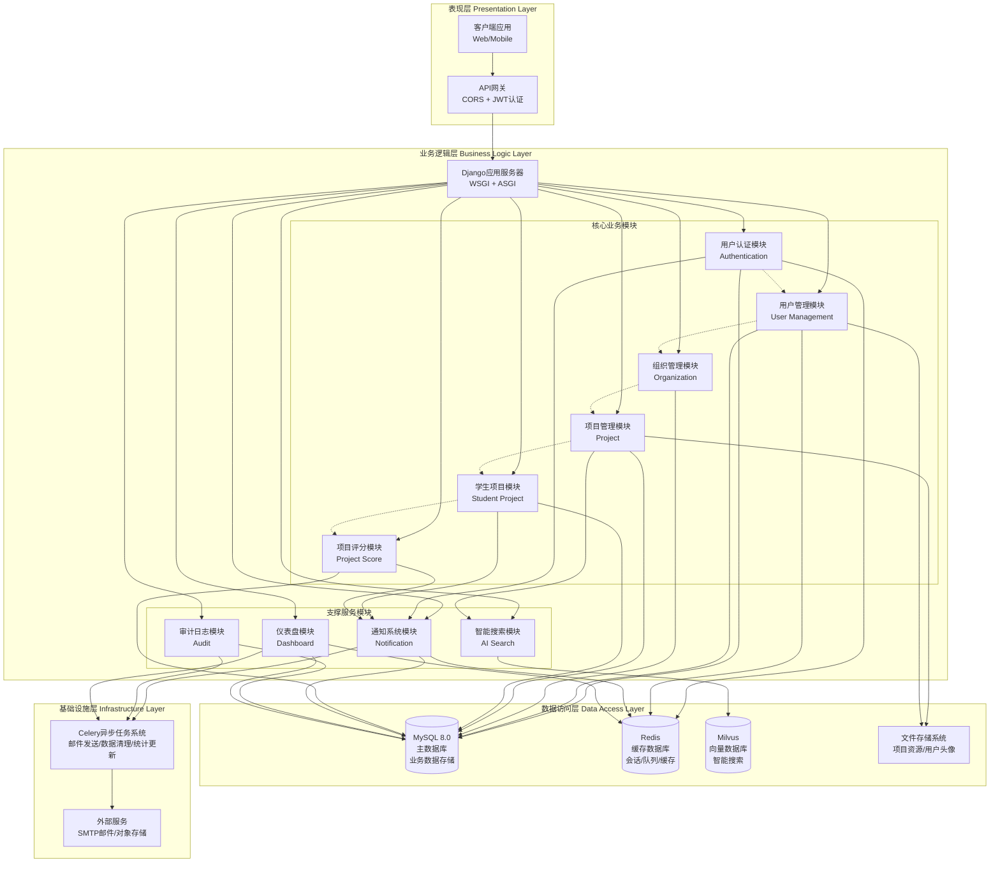

**异常处理机制：**
- **认证失败**：返回401状态码，重定向到登录页面
- **权限不足**：返回403状态码，显示权限错误信息
- **数据库连接失败**：启用Redis缓存降级服务
- **外部服务异常**：异步任务重试机制，最大重试3次

### 2.2 用户认证与注册流程

**核心功能描述：** 实现用户注册、邮箱验证、身份认证和权限管理的完整流程。

**流程节点业务逻辑：**
- **用户提交注册**：验证邮箱格式、密码强度、用户名唯一性
- **发送验证码**：生成6位数字验证码，有效期5分钟，存储在Redis中
- **验证邮箱**：校验验证码正确性和有效期，激活用户账户
- **账户创建**：验证通过后立即创建用户账户，账户注册无需审核
- **选择用户类型**：区分学生用户和组织用户，设置不同权限
- **组织用户分类**：组织用户需选择创建新组织或加入现有组织
- **新组织认证**：创建新组织需要系统管理员审核组织资质和真实性
- **加入组织审核**：加入现有组织需要组织管理员或创建者审核用户资格
- **权限激活**：审核通过后激活相应权限，可使用对应的组织端服务

**审核机制说明：**
- **账户注册**：无需审核，验证邮箱后立即创建账户
- **学生用户**：注册后直接激活，无需额外审核
- **新组织认证**：需要系统管理员审核，验证组织合法性和用户身份
- **加入组织**：需要组织内部审核，由组织管理员决定是否接受
- **重试机制**：审核失败后可修改信息重新申请或选择其他组织

**与其他模块交互：**
- **通知系统**：发送注册成功、审核结果通知
- **用户管理**：创建用户资料和权限设置
- **审计日志**：记录注册和认证操作日志
- **邮件系统**：发送验证码和审核结果通知
- **权限系统**：根据审核结果分配相应权限
- **组织管理**：处理组织创建和成员管理

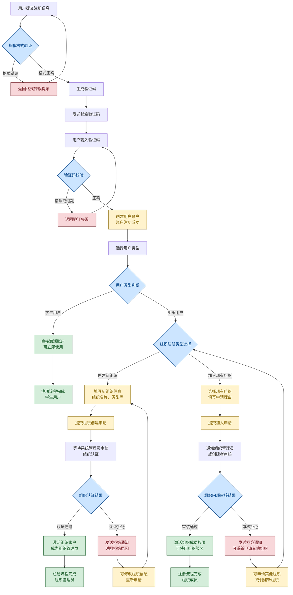

**异常处理流程：**
- **邮箱已存在**：提示用户使用其他邮箱或找回密码
- **验证码发送失败**：重试发送机制，最多3次
- **审核超时**：7天内未审核自动提醒管理员

### 2.3 项目协作完整流程

**核心功能描述：** 从需求发布到项目完成的完整协作流程，包括申请、审核、执行、评分等环节。

**流程节点业务逻辑：**
- **需求发布**：组织用户通过表单或智能体对话创建项目需求，设置技能要求、截止时间、评分标准
- **需求审核**：表单创建的需求需要系统管理员审核，智能体对话生成的需求直接发布
- **需求状态检查**：学生浏览需求时检查状态，已完成或已关闭的需求无法对接
- **学生项目对接**：学生可选择创建新项目对接需求或申请加入现有项目团队
- **团队申请审核**：学生申请加入团队时，由团队负责人审核，可能需要面试环节
- **项目团队邀请**：项目负责人可主动邀请合适的学生加入团队，学生可接受、拒绝或暂不回应
- **团队成员管理**：支持团队成员的动态调整，包括邀请新成员和处理成员变更
- **项目执行**：团队协作完成项目，上传进度和成果文件
- **成果提交**：提交最终项目成果，等待评分
- **项目评分**：组织按照评分标准对项目进行多维度评分
- **结果公示**：公布项目排名和评分结果，需求状态变更为已完成

**审核机制说明：**
- **需求发布审核**：表单方式创建需求需要系统管理员审核通过后才能发布，智能体对话方式创建的需求无需审核直接发布
- **团队加入审核**：学生申请加入现有项目团队时，由团队负责人或项目创建者进行审核，可设置面试环节
- **邀请响应机制**：项目负责人发送邀请后，学生需在规定时间内响应，超时未响应视为拒绝
- **需求状态控制**：已评分完成的需求自动标记为不可对接状态，防止重复对接

**与其他模块交互：**
- **通知系统**：各环节状态变更通知相关用户，包括审核结果、团队变更等
- **文件系统**：存储项目资料和成果文件
- **评分系统**：执行项目评分和排名计算
- **智能搜索**：支持需求和项目的智能匹配
- **AI智能体**：支持通过对话方式快速创建项目需求

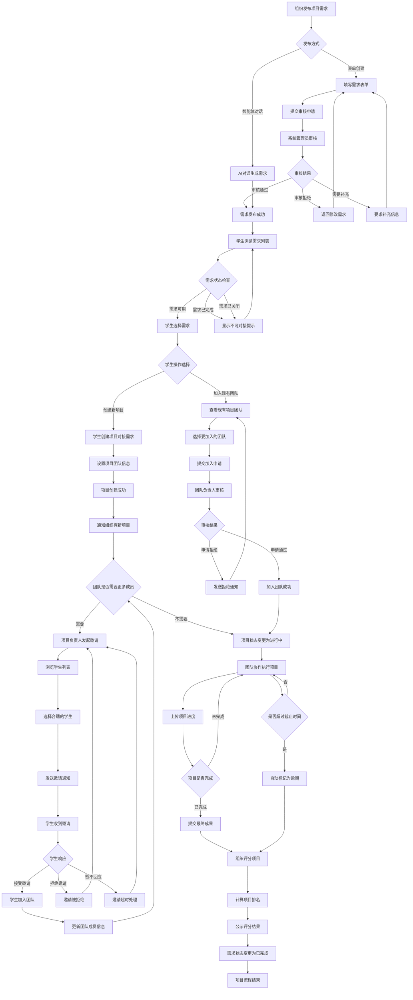

**异常处理流程：**
- **需求审核被拒绝**：组织需要修改需求内容后重新提交审核
- **需求状态不可用**：学生尝试对接已完成或已关闭的需求时，系统显示提示信息并引导选择其他需求
- **团队申请被拒绝**：学生可以申请加入其他团队或创建新的项目团队
- **项目逾期**：自动标记逾期状态，影响评分权重
- **团队成员退出**：通知组织和剩余成员，可申请新成员加入
- **面试环节失败**：学生可以重新申请或选择其他团队

### 2.4 实时通知推送流程

**核心功能描述：** 基于WebSocket和邮件的双通道通知系统，确保重要信息及时送达。

**流程节点业务逻辑：**
- **事件触发**：系统各模块产生需要通知的事件
- **通知生成**：根据事件类型和用户偏好生成通知内容
- **推送策略选择**：判断用户在线状态，选择推送方式
- **实时推送**：通过WebSocket向在线用户推送通知
- **离线存储**：为离线用户存储通知，待上线时推送
- **邮件通知**：重要通知同时发送邮件提醒

**与其他模块交互：**
- **所有业务模块**：接收各模块的事件触发
- **用户管理**：获取用户通知偏好设置
- **Celery任务**：异步处理邮件发送任务

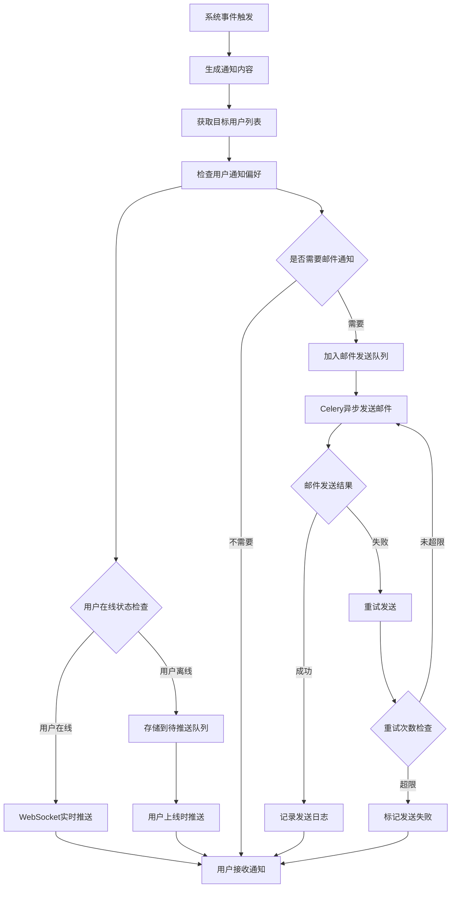

**异常处理流程：**
- **WebSocket连接断开**：自动重连机制，最多重试5次
- **邮件发送失败**：重试3次，失败后记录错误日志
- **通知队列积压**：监控队列长度，超阈值时告警

#### 2.4.1 数据库通知类型详细表格

系统目前在数据库中定义了35个通知类型，涵盖项目管理、用户管理、系统管理等各个方面：

| 序号 | 通知类型代码 | 通知名称 | 分类 | 描述 | 主要变量 |
|------|-------------|----------|------|------|----------|
| 1 | org_deliverable_comment_reply | 成果评语回复通知 | project | 当有人回复成果评语时发送给原评语发布者的通知 | project_title, deliverable_title, replier_name, reply_content |
| 2 | student_project_application | 项目申请通知 | project | 当学生申请加入项目时发送给项目负责人的通知 | applicant_name, project_title, application_message |
| 3 | student_application_result | 申请处理结果通知 | project | 当项目负责人处理项目申请时发送给申请人的通知 | applicant_name, project_title, result_display, review_message |
| 4 | student_project_status_changed | 项目状态变更通知 | project | 当项目状态发生变更时发送给项目成员的通知 | project_title, old_status_display, new_status_display, change_reason |
| 5 | org_user_registration_audit | 用户注册审核通知 | user | 当有新用户申请注册时发送给管理员的审核通知 | applicant_name, applicant_email, organization_name, application_reason |
| 6 | org_user_permission_change | 用户权限变更通知 | user | 当用户权限发生变更时发送的通知 | user_name, organization_name, old_permission_display, new_permission_display |
| 7 | org_project_requirement_created | 项目需求创建通知 | project | 当项目需求被创建时发送的通知 | student_name, project_title, requirement_title, project_description |
| 8 | org_project_status_changed | 项目状态变更通知 | project | 当项目状态发生变更时发送的通知 | project_title, old_status_display, new_status_display, student_name |
| 9 | org_user_permission_and_status_change | 用户权限和状态变更通知 | user | 当用户权限和状态同时发生变更时发送的通知 | user_name, organization_name, change_time |
| 10 | org_user_status_change | 用户状态变更通知 | user | 当用户状态发生变更时发送的通知 | user_name, organization_name, change_time |
| 11 | org_user_registration_approved | 注册申请通过通知 | user | 当用户注册申请通过时发送的通知 | user_name, organization_name, approval_time |
| 12 | org_user_registration_rejected | 注册申请拒绝通知 | user | 当用户注册申请被拒绝时发送的通知 | user_name, organization_name, rejection_reason |
| 13 | org_deliverable_submitted | 项目交付物提交通知 | project | 当项目交付物被提交时发送的通知 | student_name, project_title, deliverable_title, file_count |
| 14 | org_deliverable_updated | 项目成果更新通知 | project | 当项目成果被更新时发送的通知 | student_name, project_title, deliverable_title, file_count |
| 15 | student_project_comment | 组织项目评语通知 | project | 当组织用户对项目发布评语时发送的通知 | commenter_name, project_title, comment_content |
| 16 | student_deliverable_comment | 组织成果评语通知 | project | 当组织用户对成果发布评语时发送的通知 | commenter_name, project_title, deliverable_title, comment_content |
| 17 | org_project_comment_reply | 项目评语回复通知 | project | 当有人回复项目评语时发送给原评语发布者的通知 | project_title, replier_name, reply_content, original_comment_content |
| 18 | org_deliverable_comment_reply | 成果评语回复通知 | project | 当有人回复成果评语时发送给原评语发布者的通知 | project_title, deliverable_title, replier_name, reply_content |
| 19 | org_requirement_deadline_reminder | 需求截止评分提醒 | requirement | 当需求截止后有已完成项目待评分时发送的定时提醒通知 | requirement_title, deadline, completed_project_count, pending_score_count |
| 20 | org_project_completed | 项目完成通知 | project | 当项目完成时发送的通知 | project_title, completion_time |
| 21 | student_member_left | 成员退出项目 | project | 当项目成员退出项目时发送给项目负责人的通知 | leader_name, member_name, project_title, member_role_display |
| 22 | student_member_kicked | 成员被移出项目 | project | 当项目成员被项目负责人移出项目时发送的通知 | member_name, project_title, operator_name, reason |
| 23 | student_leadership_transfer | 项目负责人身份转移 | project | 当项目负责人身份转移时发送给新负责人的通知 | new_leader_name, project_title, original_leader, transfer_message |
| 24 | student_leadership_change_notification | 项目负责人变更通知 | project | 当项目负责人变更时发送给除新旧负责人外的所有成员的通知 | project_title, new_leader_name, original_leader, transfer_message |
| 25 | student_project_invitation | 项目邀请通知 | project | 当项目负责人邀请学生加入项目时发送的通知 | inviter_name, invitee_name, project_title, invitation_message |
| 26 | student_invitation_response | 邀请处理结果通知 | project | 当被邀请人回复项目邀请时发送给邀请人的通知 | inviter_name, invitee_name, project_title, response_display, response_message |
| 27 | student_invitation_expiry_reminder | 邀请过期提醒通知 | project | 当项目邀请即将过期时发送的提醒通知 | invitee_name, inviter_name, project_title, expires_at |
| 28 | student_project_score_published | 项目评分公示通知 | project | 当项目评分结果公示时发送给项目所有成员的通知 | project_title, total_score, weighted_score, evaluator_name |
| 29 | system_announcement | 系统公告 | system | 系统重要公告通知 | title, content, created_at, expires_at |
| 30 | maintenance_notice | 维护通知 | system | 系统维护相关通知 | title, content, maintenance_time, impact |
| 31 | version_update | 版本更新 | system | 系统版本更新通知 | title, content, version, improvements |
| 32 | urgent_notice | 紧急通知 | system | 系统紧急通知 | title, content, created_at |
| 33 | requirement_review_approved | 需求审核通过通知 | organization | 当需求审核状态从审核中变更为进行中时发送给需求发布者的通知 | publisher_name, requirement_title, reviewer_name |
| 34 | requirement_review_failed | 需求审核失败通知 | organization | 当需求审核状态从审核中变更为审核失败时发送给需求发布者的通知 | publisher_name, requirement_title, reviewer_name, review_comment |
| 35 | org_requirement_deadline_reminder | 需求截止评分提醒 | requirement | 当需求截止后有已完成项目待评分时发送的定时提醒通知 | requirement_title, deadline, completed_project_count, pending_score_count |

**通知类型统计：**
- **项目相关通知**：22个（占62.9%）
- **用户管理通知**：6个（占17.1%）
- **系统管理通知**：4个（占11.4%）
- **组织管理通知**：2个（占5.7%）
- **需求管理通知**：1个（占2.9%）

**通知触发机制：**
- **实时触发**：用户操作后立即触发的通知（如申请、评语、状态变更等）
- **定时触发**：系统定时检查并发送的通知（如截止提醒、过期提醒等）
- **管理触发**：管理员手动发送的通知（如系统公告、维护通知等）

### 2.5 数据处理与存储流程

**核心功能描述：** 系统数据从输入到输出的完整处理流程，包括验证、存储、缓存和响应等环节。

**流程节点业务逻辑：**
- **API请求处理**：接收HTTP请求，进行路由分发和权限验证
- **WebSocket消息**：处理实时通信消息，维护连接状态
- **文件上传处理**：验证文件类型和大小，存储到文件系统
- **数据验证**：使用Django序列化器验证数据格式和业务规则
- **业务逻辑处理**：执行核心业务逻辑，调用相关服务
- **数据持久化**：将数据存储到MySQL主数据库
- **缓存策略**：热点数据存储到Redis，提高访问性能
- **异步任务**：耗时操作通过Celery异步处理

**与其他模块交互：**
- **认证系统**：验证用户身份和权限
- **通知系统**：触发相关通知事件
- **搜索系统**：更新向量数据库索引

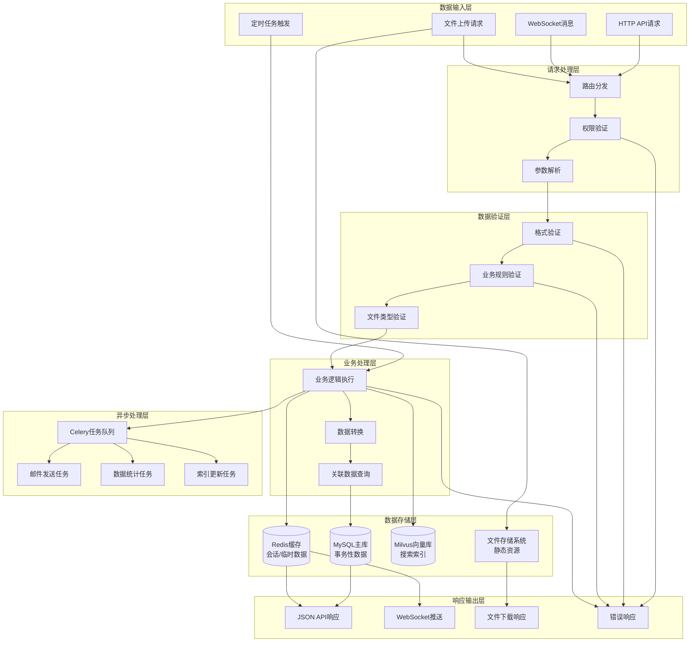

**异常处理流程：**
- **数据验证失败**：返回400错误，包含详细错误信息
- **权限验证失败**：返回403错误，记录访问日志
- **数据库连接失败**：启用Redis缓存降级，返回503错误
- **文件上传失败**：清理临时文件，返回上传错误信息

### 2.6 智能搜索数据流程

**核心功能描述：** 基于Milvus向量数据库的智能搜索功能，支持语义搜索和相似度匹配。

**流程节点业务逻辑：**
- **搜索请求**：用户输入搜索关键词或上传文档
- **文本预处理**：清理文本，分词，去除停用词
- **向量化处理**：使用预训练模型将文本转换为向量
- **相似度计算**：在Milvus中进行向量相似度搜索
- **结果排序**：根据相似度分数和业务权重排序
- **结果过滤**：根据用户权限过滤搜索结果
- **结果返回**：返回格式化的搜索结果

**与其他模块交互：**
- **项目管理**：搜索项目需求和描述
- **用户管理**：根据用户权限过滤结果
- **缓存系统**：缓存热门搜索结果

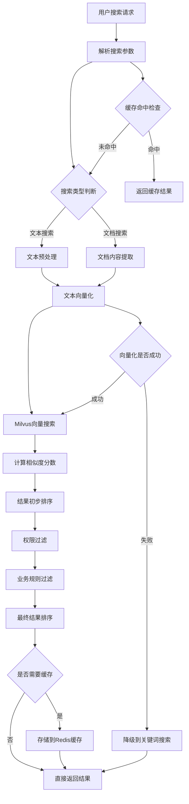

**异常处理流程：**
- **向量化失败**：降级到传统关键词搜索
- **Milvus连接失败**：使用MySQL全文搜索备用方案
- **搜索超时**：返回部分结果，记录性能日志

### 2.7 系统部署架构视图

**核心功能描述：** 基于Django单体应用的部署架构，包括负载均衡、数据库集群和缓存系统。

**架构组件说明：**
- **负载均衡器**：Nginx反向代理，分发请求到多个Django实例
- **应用服务器**：多个Django应用实例，处理业务逻辑
- **数据库集群**：MySQL主从复制，保证数据可靠性
- **缓存系统**：Redis集群，提供会话存储和数据缓存
- **向量数据库**：Milvus集群，支持智能搜索功能
- **消息队列**：Celery + Redis，处理异步任务

**与其他模块交互：**
- **监控系统**：收集各组件性能指标
- **日志系统**：集中收集和分析日志
- **备份系统**：定期备份数据库和文件

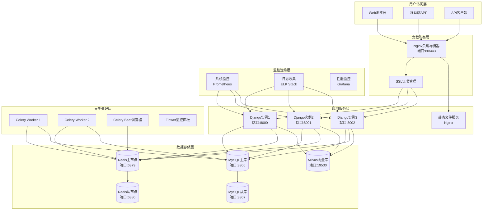

**异常处理流程：**
- **应用实例故障**：负载均衡器自动剔除故障实例
- **数据库主库故障**：自动切换到从库，保证服务可用性
- **Redis缓存故障**：降级到数据库查询，记录故障日志
- **Milvus服务故障**：搜索功能降级到MySQL全文搜索

## 3. 详细设计说明

### 3.1 核心模块设计文档

#### 3.1.1 用户认证与权限管理模块

**模块职责：**
- 用户注册、登录、注销功能
- 基于角色的权限控制（RBAC）
- JWT令牌管理和验证
- 用户会话管理

**核心API接口：**
- `POST /api/auth/register/` - 用户注册
- `POST /api/auth/login/` - 用户登录
- `POST /api/auth/logout/` - 用户注销
- `GET /api/auth/profile/` - 获取用户信息
- `PUT /api/auth/profile/` - 更新用户信息

**数据模型：**
- User：用户基本信息
- UserProfile：用户扩展信息
- Role：角色定义
- Permission：权限定义

#### 3.1.2 项目管理模块

**模块职责：**
- 项目创建、编辑、删除
- 项目成员管理
- 项目进度跟踪
- 项目文档管理

**核心API接口：**
- `GET /api/projects/` - 获取项目列表
- `POST /api/projects/` - 创建新项目
- `GET /api/projects/{id}/` - 获取项目详情
- `PUT /api/projects/{id}/` - 更新项目信息
- `DELETE /api/projects/{id}/` - 删除项目

**数据模型：**
- Project：项目基本信息
- ProjectMember：项目成员关系
- ProjectDocument：项目文档
- ProjectProgress：项目进度记录

#### 3.1.3 智能搜索模块

**模块职责：**
- 基于向量的语义搜索
- 项目内容索引管理
- 搜索结果排序和过滤
- 搜索历史记录

**核心API接口：**
- `POST /api/search/` - 执行搜索
- `GET /api/search/suggestions/` - 获取搜索建议
- `GET /api/search/history/` - 获取搜索历史
- `POST /api/search/index/` - 更新搜索索引

**技术实现：**
- 使用Milvus向量数据库存储文档向量
- 集成预训练的文本嵌入模型
- 实现增量索引更新机制
- 支持多种文档格式解析

### 3.2 异常处理与容错机制

#### 3.2.1 系统级异常处理

**数据库连接异常：**
- 实现连接池管理，自动重连机制
- 主从数据库切换，保证服务可用性
- 事务回滚和数据一致性保证

**缓存服务异常：**
- Redis连接失败时降级到数据库查询
- 缓存数据过期策略和自动刷新
- 分布式缓存一致性保证

**第三方服务异常：**
- API调用超时和重试机制
- 服务降级和熔断器模式
- 异常监控和告警机制

#### 3.2.2 业务级异常处理

**用户输入验证：**
- 前端表单验证和后端数据校验
- 恶意输入过滤和SQL注入防护
- 文件上传安全检查

**权限验证异常：**
- 未授权访问拦截和日志记录
- 权限变更实时生效机制
- 敏感操作二次验证

**业务逻辑异常：**
- 业务规则违反的友好提示
- 数据状态不一致的自动修复
- 关键业务操作的审计日志